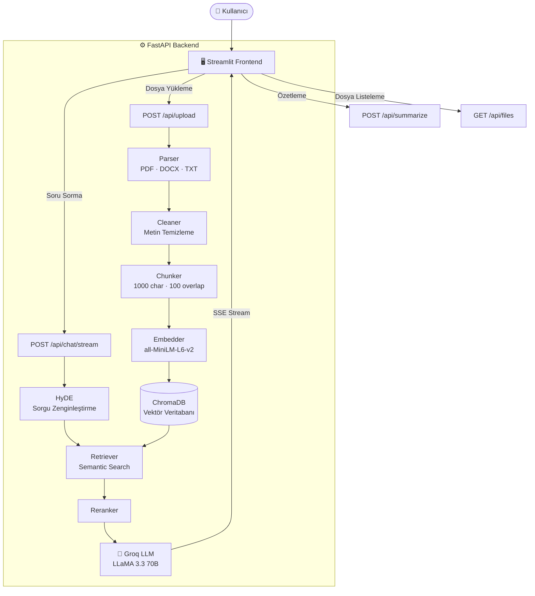

# rag-doc-assistant — Kendi Dokümanlarınla Sohbet Et


[](https://frontend-production-6f279.up.railway.app)

> Kullanıcıların sisteme yüklediği PDF, DOCX ve TXT dosyalarını analiz eden ve bu dokümanlar üzerinden yapay zeka ile sohbet edilmesini sağlayan bir **RAG (Retrieval-Augmented Generation)** projesidir.

---

## Mimari



---

## Ekran Görüntüsü


---

## Temel Özellikler

* **Hızlı Dosya Yükleme:** PDF, DOCX, DOC ve TXT dosyalarını sürükle-bırak ile yükleme ve anında işleme.
* **Kullanıcı Bazlı Doküman Yönetimi:** Her kullanıcı yalnızca kendi yüklediği dosyaları görür ve sorgular. Çıkış yapıp tekrar giriş yapıldığında dosyalar kaybolmaz.
* **Modern Chat Arayüzü:** Streamlit ile geliştirilmiş, kullanıcı dostu ve akıcı sohbet ekranı.
* **Cevap Akışı (Streaming):** Yapay zeka yanıtlarının ChatGPT'deki gibi kelime kelime akarak ekrana gelmesi.
* **Kaynak Gösterme:** Her cevabın altında hangi dosyadan üretildiği gösterilir.
* **Doküman Özetleme:** Seçili dosya veya tüm dosyalar için tek tıkla özet üretimi.
* **Gelişmiş RAG Pipeline:** HyDE (Hypothetical Document Embeddings) ile sorgu zenginleştirme, reranking ile sonuç iyileştirme.
* **LLM Dayanıklılığı:** Circuit breaker, otomatik retry ve timeout yönetimi.
* **FastAPI Backend:** Yüksek performanslı ve ölçeklenebilir arka plan motoru.
* **Docker Desteği:** Tek komutla tüm stack'i ayağa kaldırma.

## Kullanılan Teknolojiler

* **Arayüz (Frontend):** Streamlit
* **Sunucu (Backend):** FastAPI / Uvicorn
* **Vektör Veritabanı:** ChromaDB (kalıcı, disk tabanlı)
* **Embedding Modeli:** sentence-transformers / all-MiniLM-L6-v2
* **LLM:** Groq API (llama-3.3-70b-versatile)
* **Dil:** Python 3.9+
* **Konteyner:** Docker / Docker Compose

---

## Kurulum ve Çalıştırma

### 1. Yerel Kurulum (venv)

**Gereksinimler:** Python 3.9+, pip, antiword (DOC dosyaları için)

```bash
# antiword kur (macOS)
brew install antiword

# Projeyi klonla
git clone https://github.com/myy16/rag-doc-assistant.git
cd rag-doc-assistant

# ── Backend ──
cd backend
python3 -m venv venv
source venv/bin/activate          # Windows: venv\Scripts\activate
pip install -r requirements.txt

# Sunucuyu başlat
uvicorn main:app --reload
```

> **Not:** `.env` dosyasını proje **kök dizininde** (`rag-doc-assistant/.env`) oluştur:
> ```
> GROQ_API_KEY=your_key_here
> ```

Swagger UI: http://127.0.0.1:8000/docs

```bash
# ── Frontend (ayrı terminal) ──
cd rag-doc-assistant
pip install -r requirements.txt
streamlit run app.py
```

Streamlit UI: http://localhost:8501

---

### 2. Docker ile Çalıştırma

**Gereksinim:** Docker Desktop

```bash
# Proje kök dizininden
cd rag-doc-assistant
docker compose up --build
```

Swagger UI: http://localhost:8000/docs  
Streamlit UI: http://localhost:8501

Durdurmak için:
```bash
docker compose down
```

Veri (Chroma + uploads) Docker volume'larında kalıcı olarak saklanır. Sıfırlamak için:
```bash
docker compose down -v
```

Chroma vektör verisi Docker volume içinde tutulur ve `backend/data/chroma` altında kalıcıdır.

---

## API Endpoints

### POST /api/upload

Bir veya birden fazla doküman yükler. Sonuçları tümünü birden döner.

**Desteklenen formatlar:** PDF, DOCX, DOC, TXT
**Maksimum dosya boyutu:** 20 MB

**Örnek response:**
```json
{
  "uploaded_files": [
    {
      "file_id": "uuid",
      "original_name": "rapor.pdf",
      "file_type": "pdf",
      "size_mb": 0.057,
      "extracted_text": "...",
      "chunks": [
        {
          "chunk_id": "uuid",
          "file_id": "uuid",
          "source_file": "rapor.pdf",
          "file_type": "pdf",
          "chunk_index": 0,
          "total_chunks": 7,
          "text": "...",
          "char_count": 491
        }
      ],
      "chunk_count": 7
    }
  ],
  "count": 1
}
```

---

### POST /api/upload/stream

Aynı işlemi Server-Sent Events (SSE) ile yapar. Her dosya işlenince anlık event gönderir.

**Event formatı:**
```
data: {"event": "file_done", "file": {...}}
data: {"event": "error", "filename": "...", "detail": "..."}
data: {"event": "done", "count": 1}
```

---

### GET /api/files

Kullanıcının daha önce yüklediği dosyaların listesini döner.

**Query parametresi:** `username`

**Örnek response:**
```json
{
  "files": [
    {"file_id": "uuid", "original_name": "rapor.pdf", "chunk_count": 7, "size_mb": 0.0}
  ]
}
```

---

### POST /api/chat

Yüklenen dokümanlara göre soru-cevap üretir. Kaynakları da response içinde döner.

**Örnek request:**
```json
{
  "question": "Bu dokümanda ana konu nedir?",
  "top_k": 5,
  "username": "kullanici_adi"
}
```

### POST /api/chat/stream

Aynı soru-cevap işlemini Server-Sent Events ile akışlı yapar.

**Event formatı:**
```
data: {"type": "token", "content": "kelime"}
data: {"type": "sources", "content": [...]}
data: {"type": "error", "detail": "..."}
```

---

### POST /api/summarize

Seçili doküman veya tüm indeks üzerinden özet üretir.

**Örnek request:**
```json
{
  "source_file": "rapor.pdf",
  "max_chunks": 8
}
```

---

### DELETE /api/upload

Yüklenen bir dokümanı vektör veritabanından ve diskten siler.

**Örnek request:**
```json
{
  "file_id": "uuid"
}
```

---

## Doküman İşleme Pipeline

Yüklenen her dosya şu adımlardan geçer:

```
Yükleme → Parse → Temizleme → Chunking → Response
```

| Adım | Modül | Açıklama |
|------|-------|----------|
| Parse | `app/core/parser.py` | PDF (pdfplumber), DOCX/DOC (python-docx, antiword), TXT (encoding detection) |
| Temizleme | `app/core/cleaner.py` | Kontrol karakterleri, Unicode NFC, header/footer pattern'ları, fazla boşluk |
| Chunking | `app/core/chunker.py` | Recursive character splitting, chunk_size=1000, overlap=100 |
| Embedding | `app/core/embeddings.py` | sentence-transformers ile vektör üretimi |
| Retrieval | `app/core/retriever.py` | HyDE + reranking ile gelişmiş semantic search |
| Üretim | `app/core/rag_service.py` | Circuit breaker, retry, Türkçe sistem prompt |

---

## Testleri Çalıştırma

```bash
cd backend
source venv/bin/activate
pytest tests/test_chunker.py -v
```

---

## Proje Yapısı

```
rag-doc-assistant/
├── app.py                       # Streamlit frontend arayüzü
├── requirements.txt             # Frontend bağımlılıkları (streamlit, requests)
├── Dockerfile                   # Frontend Docker image
├── docker-compose.yml           # Backend + Frontend stack
├── .env                         # GROQ_API_KEY (git'e ekleme!)
└── backend/
    ├── main.py                  # FastAPI uygulama giriş noktası
    ├── requirements.txt         # Backend bağımlılıkları
    ├── Dockerfile               # Backend Docker image
    ├── app/
    │   ├── api/
    │   │   ├── upload.py        # POST/DELETE /api/upload
    │   │   ├── chat.py          # POST /api/chat, /api/chat/stream
    │   │   ├── summarize.py     # POST /api/summarize
    │   │   └── files.py         # GET /api/files
    │   └── core/
    │       ├── config.py        # Uygulama ayarları
    │       ├── parser.py        # Doküman parser'ları (PDF, DOCX, TXT)
    │       ├── cleaner.py       # Metin temizleme
    │       ├── chunker.py       # Recursive character splitting
    │       ├── embeddings.py    # sentence-transformers embedding servisi
    │       ├── vector_store.py  # ChromaDB wrapper
    │       ├── retriever.py     # Semantic search + metadata filtreleme
    │       └── rag_service.py   # RAG orchestration (index, retrieve, generate)
    └── tests/
        ├── test_chunker.py
        ├── test_rag_service.py
        └── test_api_integration.py
```

---

## Katkıda Bulunanlar

| | İsim | Görev | LinkedIn |
|---|------|-------|----------|
| 👤 | **Kübra Güler** | Doküman İşleme Pipeline — Dosya yükleme endpoint'leri, PDF/DOCX/TXT parser, metin temizleme ve chunking stratejisi | [LinkedIn](https://www.linkedin.com/in/kubradguler/) |
| 👤 | **Muhammet Yusuf Yılmaz** | RAG Engine — Embedding, ChromaDB, HyDE + reranking ile gelişmiş retrieval, LLM entegrasyonu | [LinkedIn](https://www.linkedin.com/in/myy1647/) |
| 👤 | **Feyza Aydın** | Frontend & Entegrasyon — Streamlit arayüzü, streaming response, README ve demo | [LinkedIn](https://www.linkedin.com/in/feyzaxaydin/?locale=tr) |

---

## GitHub Commit Formatı

```
(type) scope : description
```

Bu format, dokümanların nasıl işlendiğini, vektörleştiğini ve yapay zeka tarafından nasıl anlamlandırıldığını adım adım izlememizi sağlar.

### Types

| Type | Kullanım |
|------|----------|
| `(feat)` | Yeni özellikler veya arayüz bileşenleri |
| `(fix)` | Hata düzeltmeleri |
| `(style)` | Sadece görsel değişiklikler |
| `(refactor)` | RAG mantığını veya kod yapısını iyileştirme |
| `(chore)` | API anahtarları, kütüphane kurulumları veya ayar dosyaları |
| `(rag)` | Embedding, vektör veritabanı veya doküman işleme süreçleri |
| `(docs)` | README, kurulum kılavuzu veya yorum satırı eklemeleri |
| `(data)` | Veri temizleme ve ön işleme |
| `(test)` | Test ekleme veya güncelleme |
| `(config)` | Yapılandırma dosyaları |

### Örnekler

```
(feat) upload : add multi-format file support for PDF and DOCX uploads
(rag) chunking : implement recursive character splitting for better context
(rag) vector-db : integrate FAISS for efficient similarity search
(fix) parser : resolve encoding issues while reading Turkish characters in TXT files
(refactor) prompt : optimize system prompt to include source citations in responses
(data) cleaning : remove redundant white spaces and headers from parsed text
(chore) deps : add langchain and groq-sdk to requirements.txt
(style) chat : apply scrolling effect to chat window for long conversations
(docs) readme : add architecture diagram and local setup instructions
```

---

## Sorun Giderme (Troubleshooting)

### 1. Docker Build Timeout: `pip install` PyPI'dan dosya indiremedi

**Belirtiler:**
```
ERROR: Could not find a version that satisfies the requirement fastapi==0.115.0
fatal error in launcher: Unable to create process using '"C:\Python39\python.exe" "C:\Python39\Scripts\pip.exe" ...
```

**Çözüm (tercih sırasına göre):**

**Seçenek A:** docker-compose.yml'de PyPI mirror kullan (hızlı)
```bash
# Linux/macOS
docker compose up --build

# Windows MSYS2
cd backend
docker build --build-arg PIP_INDEX_URL=https://mirrors.aliyun.com/pypi/simple -t p2p_backend .
```

**Seçenek B:** Pip timeout'ını ve retry'ı artır
```dockerfile
RUN pip install --no-cache-dir \
    --retries 5 \
    --default-timeout 120 \
    -r requirements.txt
```

**Seçenek C:** Pre-built wheels cache'le (en güvenilir)
```dockerfile
# Stage 1: Download wheels
RUN mkdir -p /wheels && \
    pip download --no-cache-dir -r requirements.txt -d /wheels

# Stage 2: Install from cache
COPY --from=builder /wheels /wheels
RUN pip install --no-cache-dir --no-index --find-links /wheels -r requirements.txt
```

---

### 2. Chat Stream Timeout: Groq API'ye bağlanamıyor

**Belirtiler:**
```
[ERROR] RuntimeError: HTTP 408 Timeout connecting to api.groq.com
OR
[INFO] Fallback answer: "İlgili bağlam bulunamadı." (confidence: 0.0)
```

**Sebep:**
- Docker container'ı `api.groq.com`'a bağlanamıyor (DNS caching, egress rules, proxy)
- Ana bilgisayardan bağlantı tamam (`curl -I https://api.groq.com` → 401) ama container'dan timeout

**Çözüm (tercih sırasına göre):**

**Seçenek A:** DNS sunucularını override et (hızlı)

Dosya: `docker-compose.yml`
```yaml
services:
  backend:
    dns:
      - 8.8.8.8
      - 1.1.1.1
      - 8.8.4.4
```

Sonra:
```bash
docker compose down
docker compose up --build
```

**Seçenek B:** Zaman aşımı süresi ayarı (uzun yanıtlar için)

Dosya: `.env`
```
LLM_TIMEOUT_SECONDS=90
```

**Seçenek C:** Yerel LLM fallback (en güvenilir, gelecek sürüm)
```bash
# Llama 2 local sunucusu dağıt (ollama veya llama.cpp)
docker run -d --name ollama ollama/ollama
# rag_service.py'de fallback olarak kullan
```

**Seçenek D:** Bağlantı testi yapılı container (debug)
```bash
docker exec p2p_yzta_backend /bin/sh -c "curl -v https://api.groq.com"
```

Eğer timeout alırsan, Docker Desktop'un Network ayarlarını kontrol et:
- **Windows:** Docker Desktop → Settings → Resources → Network → DNS (8.8.8.8 ekle)
- **macOS:** Similar path

---

### 3. Test Hatası: `FakeRetriever` parametre uyuşmaması

**Belirtiler:**
```
TypeError: retrieve() missing 1 required positional argument: 'username'
OR
TypeError: _call_groq() missing required argument: 'system_prompt'
```

**Çözüm:**

Dosya: `backend/tests/test_rag_service.py`

✅ Zaten düzeltilmiş (2026-04-25):
- `FakeRetriever.retrieve()` artık `username=None` parametresini kabul ediyor
- `FakeRetriever.fetch_documents()` artık `username=None` parametresini kabul ediyor
- Test mock'ları `_call_groq` için `system_prompt=None` parametresini kabul ediyor

Testleri çalıştır:
```bash
cd backend
python -m pytest tests/test_rag_service.py -v
```

---

### 4. Embedding Modeli İndirilemiyor

**Belirtiler:**
```
[WARNING] sentence-transformers model not available; using fallback embeddings
```

**Sebep:**
- sentence-transformers model indirilemiyor (HuggingFace bağlantı sorunu, TLS hatası)
- Offline ortamda veya kısıtlı ağda çalışıyor

**Özellikleri:**
✅ **Garanti:** Yedek embedding servisi deterministic hashing kullanır
- Yükleme başarısız olmaz
- Hibrit retrieval (lexical+semantic) çalışır

**Performans notası:**
- sentence-transformers: ~0.8 F1 score (semantic accuracy)
- Fallback hashing: ~0.6 F1 score (lexical + frequency-based)

Yedek embedding'in performansını iyileştir:
```python
# backend/app/core/embeddings.py
# Fallback embedding dim'i artır (384 → 768)
# Token weight'ını optimize et
```

---

### 5. ChromaDB Verisi Kayboldu

**Çözüm:**

```bash
# Kalıcı veri nerede?
# Yerel: backend/data/chroma/
# Docker: Named volume "chroma_data"

# Kalıcı veriyi kontrol et
docker volume ls | grep chroma
docker inspect chroma_data

# Veriyi temizle (sıfırla)
docker compose down -v  # Tüm volume'ları sil
docker compose up       # Yeni baştan başla
```

---

### 6. Groq API Key Hatasız Ama Timeout

**Belirtiler:**
```
GROQ_API_KEY set ✓
/api/chat/stream calls made ✓
But responses timeout after 60 seconds
```

**Tanı komutları:**

```bash
# 1. API Key doğru mu?
docker exec p2p_yzta_backend env | grep GROQ

# 2. Groq'a ulaşılabiliyor mu?
docker exec p2p_yzta_backend curl -I https://api.groq.com
# Expected: HTTP/1.1 401 Unauthorized (iyi)
# Actual: 000 curl: operation timeout (kötü → DNS/egress sorunu)

# 3. Backend log'ları kontrol et
docker logs p2p_yzta_backend | tail -20

# 4. Groq streaming test et
curl -X POST http://localhost:8000/api/chat/stream \
  -H "Content-Type: application/json" \
  -d '{"question": "Merhaba"}' \
  -N
# Eğer timeout alırsan → Docker network konfigürasyonu kontrol et
```

---

### 7. Frontend (Streamlit) Backend'e Bağlanamıyor

**Belirtiler:**
```
ConnectionError: Cannot connect to http://backend:8000/api
```

**Çözüm:**

```bash
# 1. Container'lar çalışıyor mu?
docker ps
# p2p_yzta_backend ve p2p_yzta_frontend görülmeli

# 2. Backend sağlıklı mı?
curl http://localhost:8000/
# Expected: 200 OK

# 3. Network connectivity
docker exec p2p_yzta_frontend curl http://backend:8000/
# Expected: 200 OK

# 4. Compose ağını yeniden oluştur
docker compose down
docker network prune
docker compose up
```

---

### 8. Dosya Yüklenmiş Ama Sorguda Görülmüyor

**Sebep:**
- Farklı `username` ile yükleme ve sorgu yapıldı

**Çözüm:**

```bash
# Upload'da username koy
curl -X POST http://localhost:8000/api/upload \
  -F "files=@rapor.pdf" \
  -F "username=ayni_kullanici"

# Chat'te aynı username kullan
curl -X POST http://localhost:8000/api/chat \
  -H "Content-Type: application/json" \
  -d '{
    "question": "...",
    "username": "ayni_kullanici"
  }'
```

---

## Performans İpuçları

### Chunking'i Optimize Et
```python
# backend/app/core/config.py
CHUNK_SIZE = 1000       # Artır: better context, more tokens
CHUNK_OVERLAP = 100     # Artır: better edges, redundancy
```

### Retrieval'i Optimize Et
```python
# backend/app/core/config.py
CHROMA_TOP_K = 8        # Artır: better recall, slower response
RETRIEVER_MIN_RELEVANCE_SCORE = 0.10  # Azalt: more liberal matching
```

### Groq Timeout'ı Artır
```bash
# .env
LLM_TIMEOUT_SECONDS=120
```

---

## Başkileştirme (Deployment)

### Production Checklist

- [ ] `.env` dosyasını güvenli ortamdan oku (env vars, secret manager)
- [ ] Docker image'ları private registry'e push et
- [ ] `GROQ_API_KEY` rotasyonunu ayarla
- [ ] ChromaDB volume backup'ını planla
- [ ] Rate limiting ekle (upload, chat)
- [ ] Error logging'i centralize et (Sentry, DataDog)
- [ ] Health check endpoint'lerini monitor et

---

## Katkıda Bulunma

1. Branch oluştur: `git checkout -b feature/yeni-ozellik`
2. Değişiklik yap ve test et: `pytest tests/ -v`
3. Commit et: `(feat) scope : Açıklamalar`
4. PR aç

---

## Lisans

MIT
